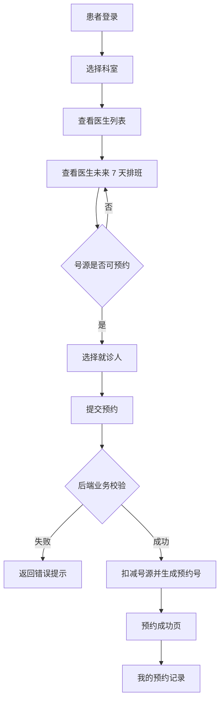
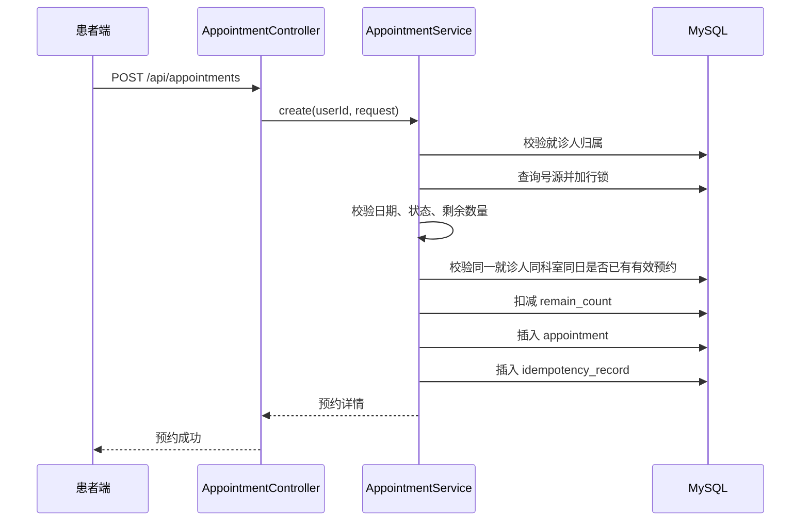
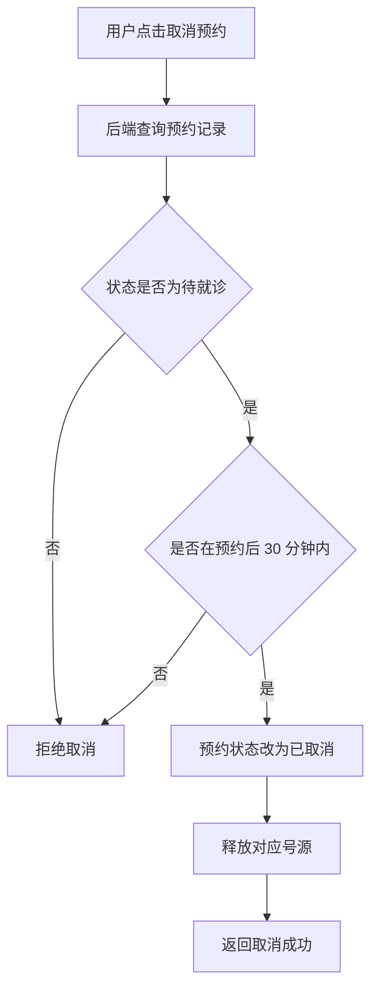

# 业务流程说明

## 患者预约流程

## 提交预约后端流程

## 取消预约流程

## 核心业务规则

1. 同一就诊人同一科室同一天只能预约一次。
2. 只能预约未来 7 天内的号源。
3. 号源状态为 `AVAILABLE` 且剩余数量大于 0 时才能预约。
4. 号源扣减必须在事务内完成。
5. 预约成功后 30 分钟内可免费取消，超过后不可取消。
6. 取消预约后需要释放号源，但停诊状态不会自动变回可预约。
7. 重复提交同一个 `idempotencyKey` 时返回已有预约结果。
8. 预约成功后模拟发送通知，记录 `notice_sent = true`。

## 并发场景说明

当两个用户同时预约同一个医生、同一天、同一时段的最后一个号源时：

- 第一个事务锁定该号源行并扣减成功。
- 第二个事务等待锁释放。
- 第二个事务再次读取时发现剩余号源为 0 或状态为 `FULL`，预约失败。

当同一就诊人尝试在同一科室同一天预约不同医生时：

- 业务层会查询是否存在有效预约。
- 数据库唯一约束 `uk_patient_dept_day_active` 作为兜底。
- 即使并发请求同时到达，也不会生成两条有效预约。
