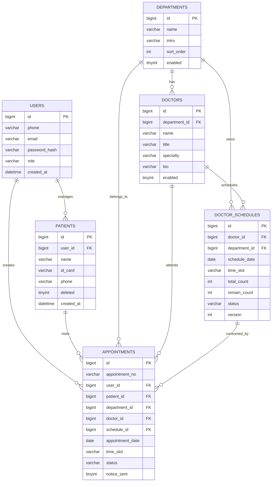

# 数据库设计

## ER 图

## 核心表说明

### users 用户表

保存登录账号信息，支持手机号或邮箱登录。

| 字段 | 说明 |
| --- | --- |
| id | 用户 ID |
| phone | 手机号，唯一 |
| email | 邮箱，唯一 |
| password_hash | 密码哈希 |
| role | PATIENT 或 ADMIN |
| created_at | 创建时间 |

### patients 就诊人表

一个用户可添加多个就诊人。

| 字段 | 说明 |
| --- | --- |
| user_id | 所属账号 |
| name | 就诊人姓名 |
| id_card | 身份证号 |
| phone | 联系电话 |
| deleted | 软删除标记 |

### departments 科室表

保存医院科室基础信息。

### doctors 医生表

医生归属于科室，包含职称、专长和简介。

### doctor_schedules 号源表

以医生、日期、时段为粒度管理号源。

| 字段 | 说明 |
| --- | --- |
| doctor_id | 医生 ID |
| department_id | 科室 ID，冗余保存方便规则校验 |
| schedule_date | 排班日期 |
| time_slot | AM 或 PM |
| total_count | 总号源 |
| remain_count | 剩余号源 |
| status | AVAILABLE、FULL、STOPPED |
| version | 乐观锁版本字段，当前主流程使用悲观锁 |

### appointments 预约记录表

保存预约流水，记录预约号、状态、取消截止时间和通知状态。

| 字段 | 说明 |
| --- | --- |
| appointment_no | 唯一预约号 |
| user_id | 发起预约的账号 |
| patient_id | 实际就诊人 |
| department_id | 科室 |
| doctor_id | 医生 |
| schedule_id | 消耗的号源 |
| status | PENDING、CANCELLED、COMPLETED |
| notice_sent | 是否已模拟发送通知 |
| cancel_deadline | 可取消截止时间 |

## 关键索引设计

| 索引 | 表 | 目的 |
| --- | --- | --- |
| `uk_users_phone` | users | 手机号唯一注册 |
| `uk_users_email` | users | 邮箱唯一注册 |
| `uk_patients_user_id_card_active` | patients | 防止同一账号重复添加同一就诊人 |
| `uk_schedule_doctor_date_slot` | doctor_schedules | 防止同一医生同一天同一时段重复排班 |
| `idx_schedule_doctor_date` | doctor_schedules | 查询医生未来 7 天排班 |
| `uk_appointments_no` | appointments | 预约号唯一 |
| `uk_patient_dept_day_active` | appointments | 防止同一就诊人同一科室同一天重复有效预约 |
| `idx_appointments_user_created` | appointments | 查询我的预约记录 |
| `uk_idempotency_user_key` | idempotency_records | 防重复提交 |

## 数据一致性考虑

- 号源扣减和预约记录创建在同一个事务内完成。
- 查询号源时使用 `SELECT ... FOR UPDATE` 对排班行加锁。
- 业务层先校验重复预约，数据库唯一索引再做兜底。
- 取消预约和释放号源在同一事务内完成。
- `idempotency_records` 记录用户提交 key，避免重复点击导致重复预约。
