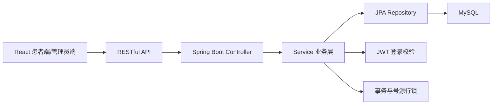

# 在线挂号系统项目说明

## 技术选型及原因

后端选择 Java 17 + Spring Boot 3 + Spring Data JPA + MySQL。挂号业务需要事务、行锁、唯一约束和清晰的 REST API，Spring Boot 与 MySQL 能较好表达这些规则。

本项目采用 Spring Boot 单体架构，未引入 Spring Cloud，原因是业务规模较小，采用单体架构可以降低部署和理解成本，避免过度设计。

前端选择 React + TypeScript + Vite + Ant Design。React 适合构建患者端多页面流程，TypeScript 能减少接口字段不一致问题，Ant Design 可以快速形成清晰的业务系统界面。

## 项目架构图



## 核心模块

- 用户与权限：患者注册、登录、JWT 鉴权，管理员接口按角色限制。
- 就诊人管理：一个账号可维护多个就诊人。
- 科室医生展示：科室列表、科室下医生、医生详情、搜索医生。
- 号源管理：展示未来 7 天排班，支持可预约、已约满、停诊状态。
- 预约挂号：选择医生排班和就诊人后提交预约，生成唯一预约号。
- 预约记录：查看我的预约，满足 30 分钟规则时可取消。
- 管理员扩展：统计每日预约量、热门科室，并维护医生排班。

## 业务思考与一致性保证

在线挂号不是普通表单提交，最重要的问题是不能重复预约、不能超卖号源。

本项目在后端实现核心规则：

- 同一就诊人同一科室同一天只能预约一次，前端只做提示，最终以后端校验为准。
- 提交预约时开启数据库事务，并对 `doctor_schedules` 号源行使用悲观锁。
- 号源剩余数量在事务内扣减，扣到 0 自动变为 `FULL`。
- 数据库对有效预约增加唯一约束，进一步防止并发情况下绕过业务校验。
- 预约成功后生成唯一预约号，并记录取消截止时间。
- 取消预约必须在创建后 30 分钟内完成，取消后释放号源。
- 提交预约支持 `idempotencyKey`，避免用户重复点击或网络重试造成重复提交。

## AI 辅助开发说明与使用体会

本项目使用 ChatGPT / Codex 类 AI 编程助手辅助完成需求拆解、代码初稿生成、接口文档整理和业务流程文档编写。

在医疗挂号业务逻辑部分，没有直接照搬 AI 初稿，而是重点做了以下人工修正和优化：

- 将“是否可预约”的判断统一放在后端 Service 层，避免只依赖前端按钮禁用。
- 增加号源行锁，保证两个用户同时预约最后一个号时不会出现超卖。
- 增加“同一就诊人同一科室同一天只能预约一次”的业务校验和数据库兜底约束。
- 将取消规则固化为“预约成功后 30 分钟内可取消”，并在取消时恢复号源。
- 增加幂等 key，减少重复提交造成的重复预约风险。
- 对管理员排班操作增加剩余号源不能大于总号源的校验。

我确保 AI 生成代码符合挂号场景的方法是：先根据业务规则设计数据库约束和事务边界，再实现接口；前端只承担流程引导，所有关键医疗规则都由后端再次校验。

这次使用 AI 的体会是：AI 能显著提升项目骨架、通用 CRUD、页面布局和文档整理效率，但医疗挂号这类业务不能只看页面是否能提交成功。真正需要人工重点把关的是号源扣减、重复预约、取消规则、并发一致性和数据库约束。AI 生成的代码更像初稿，最终仍然需要开发者根据真实业务规则检查事务边界和异常场景。

## 演示账号/演示流程

患者账号：

```text
13900000000 / 123456
```

管理员账号：

```text
18800000000 / admin123
```

推荐演示流程：

1. 使用患者账号登录系统。
2. 在“就诊人管理”中确认或新增就诊人。
3. 回到“科室挂号”，选择科室并查看医生列表。
4. 进入医生详情页，选择未来 7 天内可预约的日期和上/下午时段。
5. 选择就诊人并提交预约，查看预约成功页、预约号和注意事项。
6. 进入“我的预约”，验证预约记录和 30 分钟内取消预约功能。
7. 使用管理员账号登录，查看统计面板，并维护医生排班号源。

## 最终检查清单

- [x] 患者注册/登录、JWT 鉴权可用。
- [x] 就诊人新增、编辑、删除、查询可用。
- [x] 科室列表、医生列表、医生详情和医生排班展示可用。
- [x] 预约挂号主流程可完整走通，并生成唯一预约号。
- [x] 同一就诊人同一科室同一天重复预约会被后端拦截。
- [x] 号源扣减在事务中完成，使用行锁避免并发超卖。
- [x] 预约成功后 30 分钟内可取消，取消后释放号源。
- [x] 提交预约支持幂等 key，避免重复提交。
- [x] 管理员排班维护和统计面板可用。
- [x] API 文档、数据库设计、业务流程说明和运行指南已完成。
- [x] 后端核心业务单元测试已覆盖重复预约、号源扣减、取消释放号源、超时取消和幂等提交，测试类位于 `backend/src/test/java/com/hospital/registration/service/AppointmentServiceTest.java`。

## 页面截图

### 科室挂号首页


### 医生排班与号源


### 预约成功页


### 我的预约记录


### 管理员统计与排班


