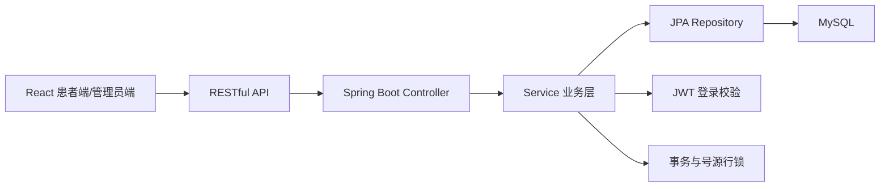
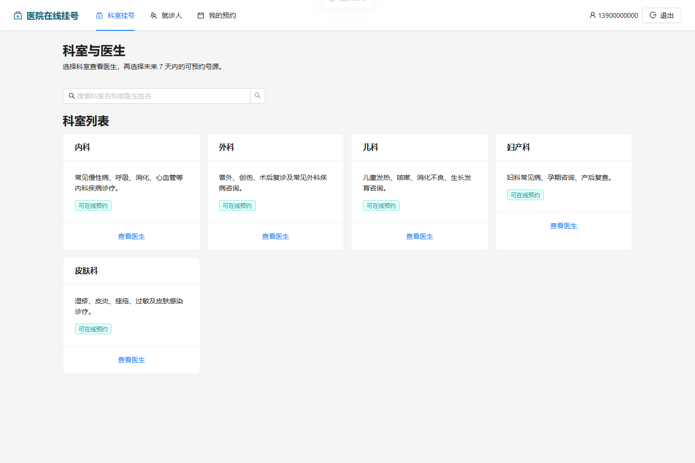
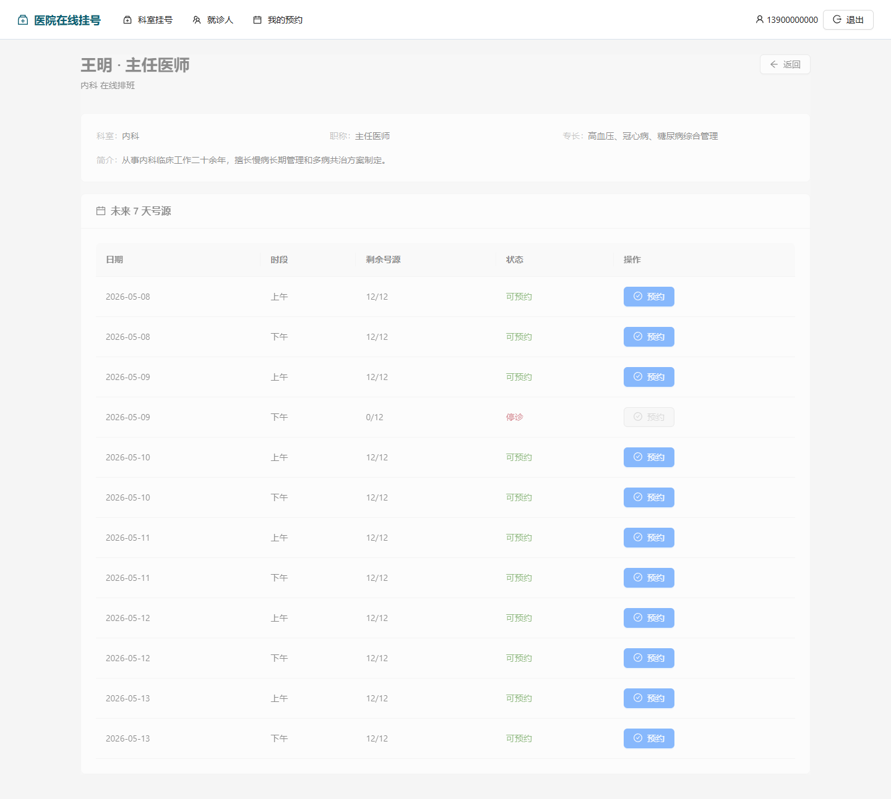
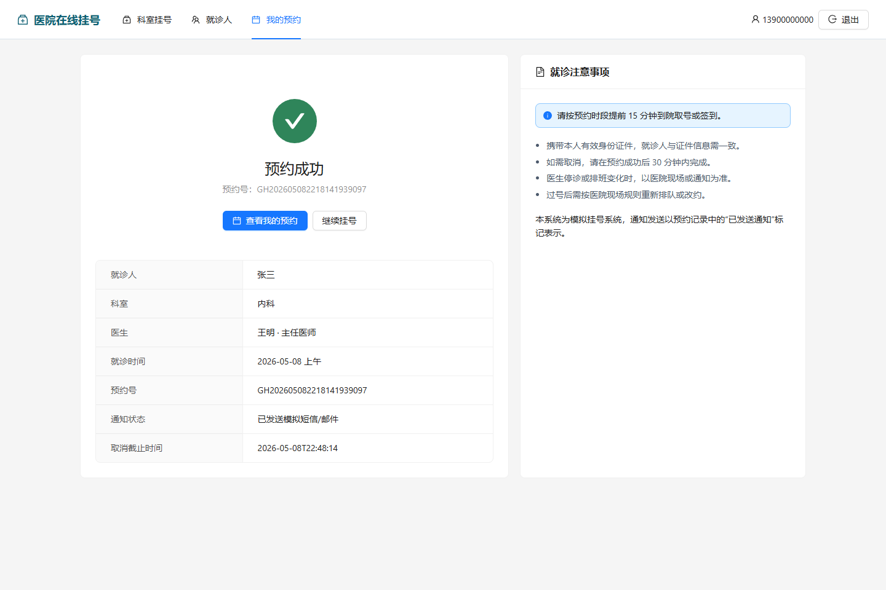
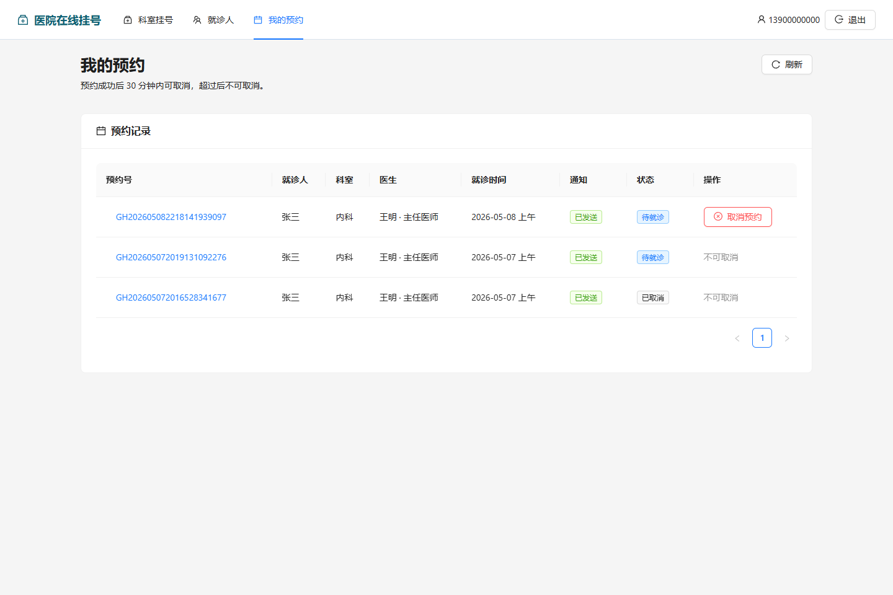
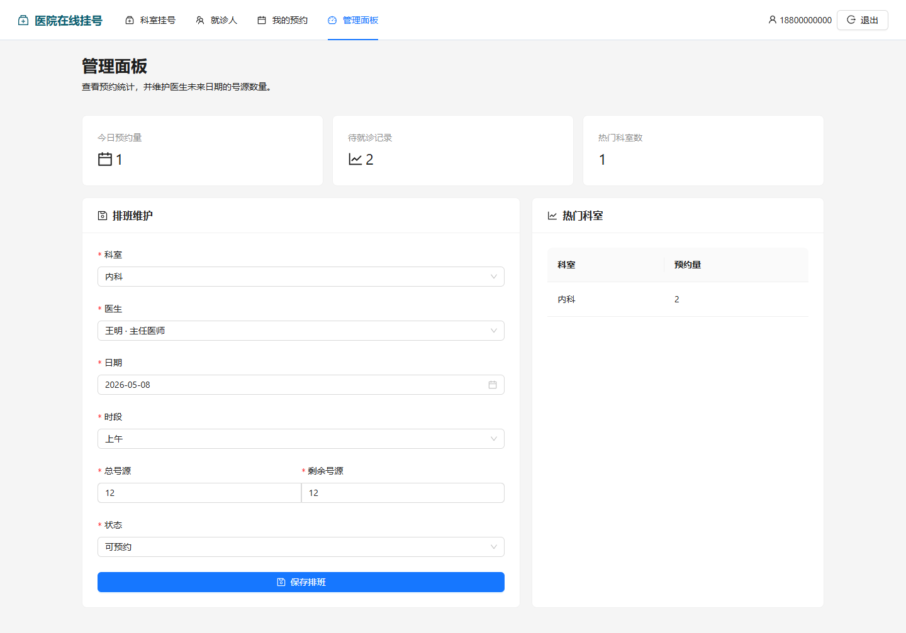

# 在线挂号系统项目说明

## 技术选型及原因

后端选择 Java 17 + Spring Boot 3 + Spring Data JPA + MySQL。挂号业务需要事务、行锁、唯一约束和清晰的 REST API，Spring Boot 与 MySQL 能较好表达这些规则。

本项目采用 Spring Boot 单体架构，未引入 Spring Cloud，原因是业务规模较小，采用单体架构可以降低部署和理解成本，避免过度设计。

前端选择 React + TypeScript + Vite + Ant Design。React 适合构建患者端多页面流程，TypeScript 能减少接口字段不一致问题，Ant Design 可以快速形成清晰的业务系统界面。

## 项目架构图



## 核心模块

- 用户与权限：患者注册、登录、JWT 鉴权，管理员接口按角色限制。
- 就诊人管理：一个账号可维护多个就诊人。
- 科室医生展示：科室列表、科室下医生、医生详情、搜索医生。
- 号源管理：展示未来 7 天排班，支持可预约、已约满、停诊状态。
- 预约挂号：选择医生排班和就诊人后提交预约，生成唯一预约号。
- 预约记录：查看我的预约，满足 30 分钟规则时可取消。
- 管理员扩展：统计每日预约量、热门科室，并维护医生排班。

## 业务思考与一致性保证

在线挂号不是普通表单提交，最重要的问题是不能重复预约、不能超卖号源。

本项目在后端实现核心规则：

- 同一就诊人同一科室同一天只能预约一次，前端只做提示，最终以后端校验为准。
- 提交预约时开启数据库事务，并对 `doctor_schedules` 号源行使用悲观锁。
- 号源剩余数量在事务内扣减，扣到 0 自动变为 `FULL`。
- 数据库对有效预约增加唯一约束，进一步防止并发情况下绕过业务校验。
- 预约成功后生成唯一预约号，并记录取消截止时间。
- 取消预约必须在创建后 30 分钟内完成，取消后释放号源。
- 提交预约支持 `idempotencyKey`，避免用户重复点击或网络重试造成重复提交。

## AI 辅助开发说明与使用体会

本项目在开发过程中使用了 AI 编程工具进行辅助开发，但核心业务规则、数据库约束设计、测试场景和最终验收均由人工判断和确认。实际使用的工具链包括：Cursor、ChatGPT、Codex、IntelliJ IDEA、Git + GitHub、MySQL Workbench / DataGrip 和 Postman。

### 1. 工具使用分工

| 工具 | 使用方式 |
| --- | --- |
| Cursor | 作为主要 AI 编码工具，用于生成和修改前后端代码、处理多文件改动、辅助编写单元测试、生成部分接口测试命令并分析报错 |
| ChatGPT | 用于需求拆解、业务规则分析、数据库设计思路梳理、接口设计建议、文档结构整理和文字润色 |
| Codex | 用于项目后期复杂 bug 排查、已有代码检查、补充测试、检查文档和代码是否一致，并根据构建或测试报错继续定位问题 |
| IntelliJ IDEA | 用于 Spring Boot 后端代码检查、运行项目、查看 Maven 编译错误和调试 Java 代码 |
| Git + GitHub | 用于版本管理、代码提交、远程仓库托管和最终项目提交 |
| MySQL Workbench / DataGrip | 用于执行数据库初始化脚本、查看表结构、检查预约记录、号源扣减和取消释放号源结果 |
| Postman | 用于保存接口集合，测试登录、注册、科室列表、医生排班查询、提交预约、预约记录查询、取消预约和管理员接口 |

其中，Cursor 是主要编码工具，主要承担代码生成、局部重构、测试补充和错误修复；ChatGPT 主要用于需求分析、业务规则设计和文档表达；Codex 主要用于项目后期的质量检查和复杂问题修复；IntelliJ IDEA、Postman 和数据库工具主要用于运行、调试和验证项目结果。

### 2. AI 在项目中的具体作用

在项目初期，我使用 ChatGPT 对题目需求进行了拆解，将在线挂号系统划分为用户权限、就诊人管理、科室医生展示、号源管理、预约挂号、预约记录和管理员扩展功能等模块，并进一步梳理了每个模块需要实现的接口和数据表。

在数据库设计阶段，我借助 AI 梳理了用户、就诊人、科室、医生、医生排班、预约记录和幂等记录之间的关系。AI 生成初步设计后，我结合在线挂号业务特点进行了人工调整，重点增加了医生排班唯一约束、预约号唯一约束、同一就诊人同一科室同一天有效预约唯一约束，以及用户维度的幂等 key 唯一约束。

在后端开发阶段，我使用 Cursor 辅助生成 Spring Boot 项目的 Controller、Service、Repository、DTO、统一响应结构和异常处理等代码。对于普通查询和基础 CRUD 代码，主要由 AI 辅助生成；对于预约挂号核心逻辑，则进行了人工审查和修改，确保关键业务规则都在后端 Service 层实现。

在前端开发阶段，我使用 Cursor 辅助生成 React + TypeScript 页面，包括登录注册、科室列表、医生详情、排班选择、就诊人管理、预约成功页、我的预约页和管理员统计面板。前端主要负责页面展示和交互体验，所有关键业务规则仍以后端校验为准。

在测试阶段，我使用 Cursor 辅助编写后端 Service 层单元测试，并通过 Maven 执行测试命令。测试文件位于：

```text
backend/src/test/java/com/hospital/registration/service/AppointmentServiceTest.java
```

该测试基于 JUnit 5 + Mockito，不启动 Spring 容器，而是通过 Mock Repository 的方式直接验证 `AppointmentService` 中的核心预约业务逻辑。测试重点覆盖重复预约、号源扣减、取消释放号源、超时取消和幂等提交等场景。

在接口调试阶段，我使用 Cursor 辅助生成部分 curl 请求并分析接口报错，同时使用 Postman 保存接口集合并进行可视化调试。测试接口包括登录、注册、科室列表、医生排班查询、提交预约、我的预约、取消预约和管理员接口。

在项目后期，我使用 Codex 辅助检查复杂问题，包括接口字段不一致、测试失败、文档与代码不一致、构建报错和代码结构优化等问题，并根据反馈进行修复。

### 3. 对 AI 生成代码的人工修正

虽然 AI 可以提高开发效率，但在线挂号系统涉及医疗预约场景，不能只依赖 AI 生成的普通 CRUD 代码。因此，我对 AI 生成的代码进行了人工审查和修正，重点包括以下方面：

1. **核心业务规则必须放在后端实现**

   AI 初稿中部分限制容易偏向前端控制，例如按钮禁用、页面提示等。但在实际业务中，前端限制不能保证安全性。因此本项目将重复预约校验、号源状态校验、剩余号源校验、就诊人归属校验、取消时间校验等关键规则统一放在后端 Service 层。

2. **使用事务保证预约数据一致性**

   提交预约时，扣减号源和生成预约记录必须同时成功或同时失败。取消预约时，修改预约状态和恢复号源也必须在同一个事务中完成。因此本项目在创建预约和取消预约逻辑中使用事务，避免出现预约记录和号源数量不一致的问题。

3. **使用悲观锁防止号源超卖**

   在线挂号系统中可能出现多个用户同时预约最后一个号源的情况。为了防止并发超卖，本项目在查询医生排班号源时使用悲观写锁，确保同一条号源记录在同一时间只会被一个事务扣减。

4. **增加数据库约束作为兜底**

   除了后端代码校验外，本项目还在数据库层增加了关键唯一约束。例如：同一医生同一天同一时段只能有一条排班记录；预约号必须唯一；同一就诊人同一科室同一天只能存在一条有效预约；同一用户同一个幂等 key 只能处理一次。这些约束可以在程序异常或并发情况下提供数据库层面的兜底保护。

5. **增加幂等提交设计**

   用户可能因为网络延迟或重复点击按钮，多次提交同一个预约请求。因此本项目增加了 `idempotencyKey` 机制，避免同一次预约请求被重复处理，减少重复预约记录的风险。

6. **完善取消预约规则**

   根据题目要求，预约后 30 分钟内可以取消，超过后不可取消。本项目在预约创建时记录取消截止时间，在取消接口中由后端判断是否仍允许取消，而不是只依赖前端页面判断。

### 4. 测试与验证方式

为了验证 AI 辅助生成的代码是否符合业务要求，本项目采用了多种方式进行测试和检查：

1. 使用 JUnit 5 + Mockito 对后端核心预约业务进行单元测试，重点覆盖重复预约、号源扣减、取消释放号源、超时取消和幂等提交等场景。
2. 使用 Cursor 辅助生成测试代码、补充 Mock 数据，并根据 `mvn test` 的报错修复测试问题。
3. 使用 Cursor 辅助生成部分 curl 请求，对接口进行快速验证。
4. 使用 Postman 测试登录、注册、科室列表、医生排班查询、提交预约、我的预约、取消预约和管理员接口。
5. 使用 MySQL Workbench / DataGrip 检查数据库中的预约记录、号源剩余数量和取消预约后的数据变化。
6. 使用前端页面完整走通患者挂号流程：登录 / 注册 → 添加就诊人 → 查看科室 → 选择医生 → 选择排班 → 提交预约 → 查看预约记录 → 取消预约。
7. 使用 Git + GitHub 管理代码版本，避免 AI 修改代码后难以回退。

### 5. 使用 AI 编程工具的体会

通过本项目，我体会到 AI 编程工具可以明显提高开发效率，尤其是在生成项目结构、编写重复性代码、整理接口文档、修复编译错误和补充测试方面非常有帮助。

但 AI 生成的代码不能直接作为最终结果。在线挂号系统虽然是一个模拟项目，但它包含医疗预约场景中比较重要的业务规则，例如号源不能超卖、同一就诊人不能重复预约、取消预约需要时间限制、重复提交需要幂等处理等。这些规则需要开发者自己理解和判断，不能完全依赖 AI 自动生成。

在本项目中，AI 更多承担“编码助手”和“检查助手”的角色。我主要负责需求理解、业务规则判断、数据库约束设计、核心代码审查、接口测试和最终验收。通过这种方式，既利用 AI 提高了开发效率，也保证了项目没有偏离在线挂号业务本身的严谨性。

最终，本项目不是简单依赖 AI 生成 CRUD，而是在 AI 辅助基础上，结合人工分析、单元测试、接口测试和数据库验证，实现了一个较完整的在线挂号业务流程。

## 演示账号/演示流程

患者账号：

```text
13900000000 / 123456
```

管理员账号：

```text
18800000000 / admin123
```

推荐演示流程：

1. 使用患者账号登录系统。
2. 在“就诊人管理”中确认或新增就诊人。
3. 回到“科室挂号”，选择科室并查看医生列表。
4. 进入医生详情页，选择未来 7 天内可预约的日期和上/下午时段。
5. 选择就诊人并提交预约，查看预约成功页、预约号和注意事项。
6. 进入“我的预约”，验证预约记录和 30 分钟内取消预约功能。
7. 使用管理员账号登录，查看统计面板，并维护医生排班号源。

## 最终检查清单

- [x] 患者注册/登录、JWT 鉴权可用。
- [x] 就诊人新增、编辑、删除、查询可用。
- [x] 科室列表、医生列表、医生详情和医生排班展示可用。
- [x] 预约挂号主流程可完整走通，并生成唯一预约号。
- [x] 同一就诊人同一科室同一天重复预约会被后端拦截。
- [x] 号源扣减在事务中完成，使用行锁避免并发超卖。
- [x] 预约成功后 30 分钟内可取消，取消后释放号源。
- [x] 提交预约支持幂等 key，避免重复提交。
- [x] 管理员排班维护和统计面板可用。
- [x] API 文档、数据库设计、业务流程说明和运行指南已完成。
- [x] 后端核心业务单元测试已覆盖重复预约、号源扣减、取消释放号源、超时取消和幂等提交，测试类位于 `backend/src/test/java/com/hospital/registration/service/AppointmentServiceTest.java`。

## 后端测试说明

后端核心业务单元测试位于：

```text
backend/src/test/java/com/hospital/registration/service/AppointmentServiceTest.java
```

该测试基于 JUnit 5 + Mockito，使用 `@ExtendWith(MockitoExtension.class)`，并 mock 了 `AppointmentRepository`、`PatientRepository`、`DoctorScheduleRepository`、`DepartmentRepository`、`DoctorRepository`、`IdempotencyRecordRepository`，直接测试 `AppointmentService` 的核心业务逻辑。

测试重点覆盖重复预约拦截、号源扣减、最后一个号源约满、取消释放号源、超时取消失败和幂等重复提交等核心预约场景。该测试属于 Service 层单元测试，不是启动 Spring 容器并连接数据库的 Spring Boot 集成测试。

## 页面截图

### 科室挂号首页



### 医生排班与号源



### 预约成功页



### 我的预约记录



### 管理员统计与排班


